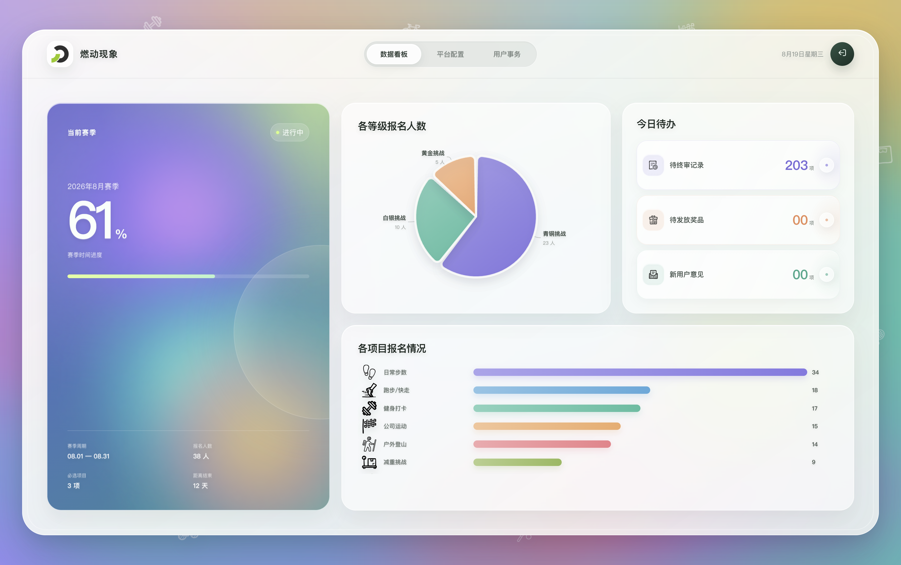
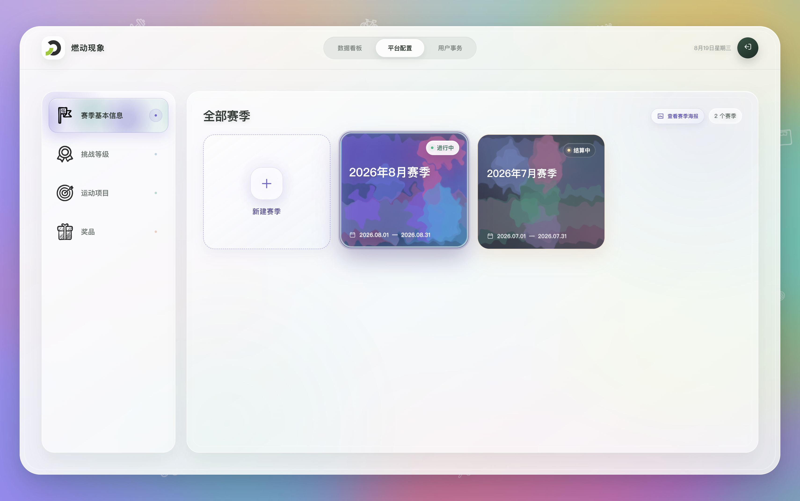
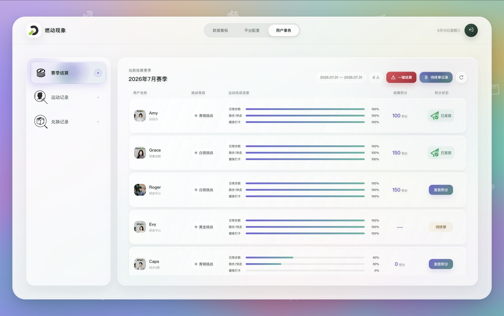
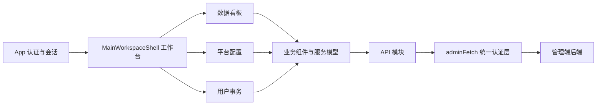

# 燃动现象管理端

燃动现象管理端是面向企业运动赛季运营人员的 Web 前端，用于查看赛季数据、维护平台配置、审核运动凭证、完成赛季积分结算，以及处理奖品发放和用户意见。

本仓库只包含管理端前端。业务数据、认证、审核、结算和积分事务均由管理端后端负责，前端通过同源 `/flame/admin/api` 接口访问这些能力。

> [!IMPORTANT]
> 项目已进入功能收口阶段，大部分管理流程已接入真实接口。用户事务中的“运动记录”和“积分与兑换”已经接入查询智能体正式接口，查询过程、人工交互、轨迹和结果均来自后端任务会话。

---

## 功能概览

| 模块 | 已实现能力 | 当前边界 |
| --- | --- | --- |
| 管理员认证 | 管理密钥登录、短期 Bearer Token、标签页会话恢复、统一失效退出 | 暂无管理员账号、角色和细粒度权限体系 |
| 数据看板 | 当前赛季概览、等级与项目报名统计、人员多项目进度、待终审凭证、待发放奖品、用户意见 | 用户意见接口尚无已读状态和独立详情 |
| 赛季配置 | 赛季列表、新建赛季、状态展示、长海报查看与更换 | 暂不支持编辑、删除和手动变更赛季状态 |
| 挑战配置 | 挑战等级列表与创建、奖励积分修改、运动项目创建、规则修改、项目显隐 | 暂不支持项目资料编辑、规则指标结构调整和独立上传配置维护 |
| 奖品配置 | 商品列表、图片加载、新增、资料与图片修改、上下架 | 不提供商品物理删除 |
| 赛季结算 | 结算人员、待终审记录、终审通过或拒绝、单人积分发放、一键结算 | 高风险写操作均以服务端事务结果为准，不做乐观更新 |
| 记录查询 | 自然语言查询、SSE 实时进度、确认与澄清、查询历史、动态表格、凭证图片预览、Excel 导出 | 查询会话暂存于后端单进程内存，受 TTL 和历史条数限制 |

详细的业务规则和接口状态参见[项目说明](description/project.md)与[文档地图](description/README.md)。

---

## 界面预览

| 数据看板 | 平台配置 | 用户事务 |
| --- | --- | --- |
|  |  |  |

---

## 技术栈

| 技术 | 用途 |
| --- | --- |
| Vue 3 | 单文件组件、响应式状态与页面编排 |
| Vite 8 | 开发服务、子路径构建与代码分包 |
| PixiJS 8 | 赛季液体表面、等级光环、项目星河和交互特效 |
| Apache ECharts 6 | 挑战等级和运动项目报名统计 |
| ExcelJS 4 | 智能查询结果与赛季积分分布导出 |
| 原生 Fetch API | 统一认证请求、二进制图片与 multipart 上传 |

项目使用 JavaScript、ES Modules 和 Vue `<script setup>`，当前没有引入路由库或全局状态管理库。三个业务页面常驻于工作台轨道中，通过组件状态和共享服务模型协作。

---

## 架构概览



主要分层如下：

- `src/components/` 负责页面编排、业务展示和交互状态。
- `src/services/` 负责接口结果聚合、共享目录、缓存、并发和图片调度。
- `src/api/` 负责请求参数、响应校验、错误适配和安全提示。
- `src/api/adminHttpClient.js` 统一注入管理员令牌并处理认证重定向。
- `src/config/requestPaths.js` 从当前 Vite 基础路径派生 API 地址，业务模块不自行判断 `/dev` 前缀。

用户姓名、部门和头像等相对稳定的信息由工作台用户目录统一缓存；`season_user_id` 与 `user_id` 的关系也在目录中建模，避免看板和结算页面重复请求。

---

## 查询智能体

用户事务的“运动记录”和“积分与兑换”共用 `ProofRecordQueryPanel`，但使用不同的业务域：

| 入口 | `domain_key` | 查询范围 | 额外能力 |
| --- | --- | --- | --- |
| 运动记录 | `sports` | 运动凭证、审核状态、项目进度及相关汇总 | `proof_record_id` 可打开受保护凭证图片 |
| 积分与兑换 | `rewards` | 积分流水、商品兑换和发放相关结果 | 表格只读，不展示凭证图片 |

前端通过 `/flame/admin/api/agent/queries` 创建异步查询任务，创建成功只代表任务已进入后端会话，不代表结果已经生成。任务运行期间使用带 Bearer Token 的 `fetch` 流式读取 SSE：

1. 任务节点持续从底部淡入，并串成查询轨迹。
2. 智能体需要对齐需求时，页面展示确认选项或澄清输入框；规划完成后还会明确提示管理员核对行粒度、结果字段和返回范围，可确认继续或请求修正后再次核对。
3. 管理员可以点击 `Stop`，调用删除接口取消任务；服务端确认后才归档为 `cancelled`。
4. 进入终态后，前端读取 `/trace` 保存完整轨迹，并按同一 `query_id` 读取 `/result` 表格。
5. 完成结果直接保留在当前查询下方，支持动态列筛选、完整 Excel 下载；运动记录中带有效凭证 ID 的行还可以读取凭证图片。

查询历史通过 `/cached-record-ids?limit=100` 获取后端当前进程仍保留的任务 ID，再并发读取状态，只展示 `completed`、`abandoned`、`failed` 和 `cancelled` 等终态。两个入口会按照会话返回的 `domain_key` 分别筛选历史，避免运动查询和积分兑换查询混淆。后端重启或 TTL 到期后，任务 ID 会自然失效，前端不会保留陈旧占位记录。

> [!IMPORTANT]
> 前端只展示后端返回的安全事件、轨迹和审计后结果，不接收或执行 SQL、模型原始响应、隐藏推理和工具参数。查询结果表头以 `headers[].key` 与 `headers[].label` 为准，不能根据数据库字段自行猜测。

完整请求、响应、状态和错误处理见[查询智能体接口](description/api/agent/query-agent.md)，页面交互细节见[用户事务页面](description/features/user-affairs.md)。

---

## 快速开始

### 环境要求

- Node.js 22，和生产镜像的构建环境保持一致。
- npm 10 或更高版本。
- 可访问的管理端后端和按项目约定配置的 Nginx 开发反向代理。

### 安装与配置

```bash
npm ci
cp .env.example .env
```

默认开发配置为：

```dotenv
APP_ENV=development
VITE_DEV_APP_BASE_PATH=/dev/flame/admin/
VITE_DEV_API_BASE_PATH=/dev/flame/admin/api
VITE_PRODUCTION_APP_BASE_PATH=/flame/admin/
VITE_PRODUCTION_API_BASE_PATH=/flame/admin/api
VITE_DEV_SERVER_HOST=127.0.0.1
VITE_DEV_SERVER_PORT=8081
```

`VITE_*` 变量会进入浏览器构建产物，只能保存公开路径配置。管理员密钥、令牌、数据库密码和内部服务凭证不得写入 `.env` 或前端代码。

### 启动开发服务

```bash
npm run dev
```

Vite 固定监听 `127.0.0.1:8081`，并启用 `strictPort`。外部访问应经过宿主机 Nginx：

- `https://pheno.szkl.com/dev/flame/admin/`
- `https://phenosolar.cloud/dev/flame/admin/`

开发 API 请求使用 `/dev/flame/admin/api`。Nginx 只移除最外层 `/dev`，再把请求转发给监听 `127.0.0.1:8001` 的管理端后端。直接暴露 Vite 端口不会自动获得这条 API 转发链路。

完整代理约定参见[管理端环境路径与开发反向代理](description/architecture/development-reverse-proxy.md)。

---

## 常用命令

| 命令 | 说明 |
| --- | --- |
| `npm run dev` | 启动 Vite 开发服务 |
| `npm test` | 使用 Node.js Test Runner 执行 `tests/*.test.js` |
| `npm run build` | 按当前 `APP_ENV` 校验路径并生成 `dist/` |
| `npm run preview` | 本地预览已经构建的静态产物 |

提交改动前至少执行：

```bash
npm test
npm run build
```

> [!NOTE]
> `.gitignore` 已排除 `tests/` 下新产生的本地测试内容；仓库中已经纳入版本控制的测试文件仍会继续被 Git 跟踪。

---

## 环境与请求路径

| 环境 | 页面路径 | API 路径 |
| --- | --- | --- |
| 开发 | `/dev/flame/admin/` | `/dev/flame/admin/api` |
| 生产 | `/flame/admin/` | `/flame/admin/api` |

Vite 启动或构建时会校验以下约束：

- `APP_ENV` 只能是 `development` 或 `production`。
- 应用路径必须以 `/` 开头并以 `/` 结尾。
- API 路径必须等于对应应用路径拼接 `api`。
- 开发路径必须包含 `/dev/` 前缀，生产路径禁止包含该前缀。
- 开发端口必须是 `1～65535` 之间的整数。

所有受保护业务接口都应放在 `src/api/` 中，并通过 `adminFetch()` 使用相对于 API 根路径的地址。认证头像、项目图标、凭证、商品图片和海报均以 Blob 方式经过管理端后端中转，不直接暴露客户端文件路径。

---

## 目录结构

```text
.
├── src/
│   ├── api/                 # 接口调用、响应校验与错误适配
│   ├── assets/              # 本地 WebP 图标和视觉资源
│   ├── components/          # 页面、业务组件和 PixiJS / ECharts 视图
│   ├── composables/         # Vue 组合式能力
│   ├── config/              # 环境请求路径
│   ├── services/            # 聚合模型、缓存、并发与资源调度
│   └── utils/               # 图片处理、滚动控制、导出与视觉参数
├── description/
│   ├── architecture/        # 架构与部署约定
│   ├── features/            # 跨组件业务流程
│   ├── components/          # 组件职责与契约
│   ├── api/                 # 接口与前端服务说明
│   └── db/                  # 数据库结构文档，默认只读
├── tests/                   # Node.js 自动化测试
├── Dockerfile               # Node 构建 + Nginx 运行的两阶段镜像
├── nginx.conf               # 生产静态资源与同源 API 转发
├── vite.config.js           # 子路径、环境校验和开发服务配置
└── AGENTS.md                # 项目开发与文档协作规范
```

---

## 生产构建与部署

生产构建固定使用 `/flame/admin/` 页面路径和 `/flame/admin/api` 接口路径。前端配置会在构建阶段写入静态产物，容器启动后修改环境变量不会改变已生成资源。

项目 `Dockerfile` 使用两阶段构建：

1. Node.js 22 执行 `npm ci` 和 `npm run build`。
2. Nginx 1.27 提供静态资源，并把同源 API 转发到 `manage-backend:8000`。

在部署根目录 `/home/ubuntu/flame` 中校验并构建：

```bash
docker compose config --quiet
docker compose build manage-frontend
```

前端容器默认映射为 `127.0.0.1:18081 -> manage-frontend:80`。宿主机 Nginx 必须保留 `/flame/admin` 前缀转发；容器依赖 Compose 网络中的 `manage-backend` 服务名，不能在缺少对应上游时独立承担完整业务访问。

详细部署、缓存和验证方式参见[管理端前端 Docker Compose 部署](description/architecture/docker-compose-deployment.md)。

---

## 文档导航

第一次参与项目时，建议按以下顺序阅读：

1. [AGENTS.md](AGENTS.md)：编码、接口、中文注释、文档同步和数据库文档保护规则。
2. [文档地图](description/README.md)：按架构、功能、组件、接口和数据实体定位资料。
3. [项目说明](description/project.md)：业务角色、赛季玩法、审核、结算和积分规则。
4. [文档规范](description/document-style.md)：Markdown 结构和写作要求。

常用业务入口：

- [数据看板](description/features/dashboard.md)
- [平台配置](description/features/platform-configuration.md)
- [赛季管理](description/features/season-management.md)
- [挑战配置管理](description/features/challenge-management.md)
- [运动凭证终审](description/features/proof-review.md)
- [用户事务](description/features/user-affairs.md)
- [积分商城与奖品发放](description/features/mall-management.md)
- [赛季结算接口](description/api/settlement/season-settlement.md)

> [!WARNING]
> `description/db/` 是既定数据模型的只读依据。业务流程以功能文档和后端契约为准，不得只根据数据库字段推测接口或页面行为。

---

## 开发约定

- 页面负责业务编排，组件、服务和 API 模块保持职责清晰。
- 网络请求集中在 `src/api/`，展示组件不直接拼接接口地址。
- 关键业务规则、状态转换和浏览器兼容处理使用准确的中文注释说明原因。
- 写请求不自动重试；网络结果不明确时，先重新查询服务端状态。
- 异步页面应区分加载、空数据、失败、认证失效和重复提交状态。
- 新增或修改重要功能时，同步更新 `description/` 下对应文档及文档地图。
- 不覆盖来源不明的工作区改动，不在前端保存任何密钥或服务端凭证。

完整要求以 [AGENTS.md](AGENTS.md) 为准。

---

## 已知限制

- 页面切换目前由常驻组件轨道管理，未接入 Vue Router 和浏览器历史记录。
- 查询任务当前仅存于后端单进程内存，服务重启后旧 `query_id` 不再可用；部署查询智能体时不得启用多 Worker。
- 查询历史受后端 `AGENT_QUERY_EVENT_HISTORY_SIZE` 与 `AGENT_QUERY_SESSION_TTL_SECONDS` 等保留策略限制。
- 赛季不支持编辑、删除或手动变更状态。
- 运动项目不支持已有资料编辑、指标结构调整或独立上传配置维护。
- 用户意见没有已读状态、回复、独立详情或可见性修改。
- 管理端认证是单一密钥准入，不是完整权限系统。
- 生产入口是否公开仍取决于仓库外宿主机 Nginx 的实际配置与发布流程。
