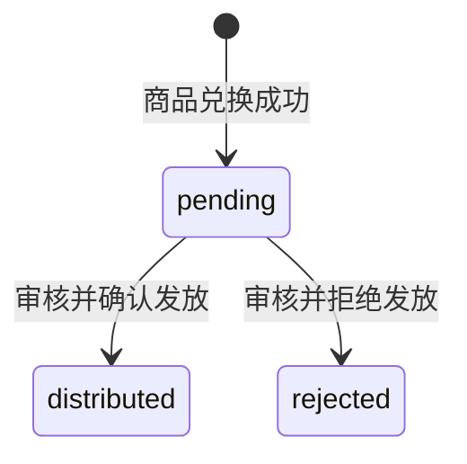

# 积分变动记录表：point_record

## 表作用

`point_record` 表用于记录用户全局积分的每一次变动，并为商品兑换流水保存礼品履约状态。

当前平台中，用户积分是跨赛季累积的，不再只归属于某一个赛季。  
无论是赛季结束后统一发放的奖励积分，还是用户在积分商城兑换商品消耗的积分，都会记录在本表中。

该表同时覆盖以下场景：

- 赛季奖励发放
- 商品兑换扣减
- 礼品拒绝发放后的兑换积分退还
- 后台人工补发积分
- 后台人工扣减积分

---

## 字段说明

| 字段名 | 类型 | 是否必填 | 默认值 | 说明 |
| --- | --- | ---: | ---: | --- |
| `id` | `BIGINT UNSIGNED` | 是 | 自增 | 积分变动记录主键 ID |
| `user_id` | `VARCHAR(64)` | 是 | 无 | 用户 ID，关联 `user.id` |
| `product_id` | `BIGINT UNSIGNED` | 否 | `NULL` | 商品 ID，关联 `product.id`，商品兑换及其退款流水使用 |
| `change_type` | `VARCHAR(32)` | 是 | 无 | 积分变动类型 |
| `change_points` | `INT` | 是 | 无 | 本次积分变动值，正数表示增加，负数表示扣减 |
| `points_after` | `INT UNSIGNED` | 是 | 无 | 本次变动后的用户积分余额 |
| `description` | `VARCHAR(255)` | 否 | `NULL` | 积分变动描述 |
| `status` | `TINYINT UNSIGNED` | 是 | `1` | 记录状态：`1` 有效，`0` 作废 |
| `gift_distribution_status` | `VARCHAR(16)` | 是 | `pending` | 商品兑换礼品发放状态，仅 `change_type = exchange` 时有效 |
| `created_at` | `DATETIME` | 是 | `CURRENT_TIMESTAMP` | 积分变动时间 |

---

## 字段设计说明

### id

积分变动记录的唯一标识。

使用 `BIGINT UNSIGNED AUTO_INCREMENT` 作为主键。

### user_id

用户 ID。

该字段关联 `user.id`，表示这条积分变动属于哪个用户。

当前积分为用户全局积分，跨赛季累积，因此本表直接关联用户，不再关联 `season_user`。

### product_id

商品 ID。

该字段关联 `product.id`，允许为空。

当积分变动类型为商品兑换或兑换退款时，该字段记录对应商品：

```text
change_type = exchange
product_id = 对应商品 ID
```

```text
change_type = exchange_refund
product_id = 原兑换商品 ID
```

当积分变动类型为赛季奖励或后台人工调整时，该字段为空：

```text
change_type = season_reward
product_id = NULL
```

```text
change_type = manual_adjust
product_id = NULL
```

### change_type

积分变动类型。

建议取值：

```text
season_reward
exchange
exchange_refund
manual_adjust
```

含义如下：

```text
season_reward = 赛季奖励发放
exchange      = 商品兑换扣减
exchange_refund = 礼品拒绝发放后的兑换积分退还
manual_adjust = 后台人工调整
```

后续如果需要扩展其他积分来源，可以继续增加类型。

### change_points

本次积分变动值。

该字段使用有符号整数。

规则：

```text
正数 = 增加积分
负数 = 扣减积分
```

示例：

```text
+60  2026年7月赛季黄金挑战达标奖励
-30  兑换商品：跳绳
+10  后台补发积分
-5   后台扣减异常积分
```

### points_after

本次积分变动后的用户积分余额。

示例：

```text
变动前积分：100
本次兑换商品：-30
变动后积分：70
```

则记录为：

```text
change_points = -30
points_after = 70
```

该字段用于：

- 前端展示积分余额
- 展示兑换后剩余积分
- 后台排查积分争议
- 避免每次查询都聚合全部积分记录

### description

积分变动描述。

用于记录本次积分变动的业务说明。

示例：

```text
2026年7月赛季黄金挑战达标奖励
兑换商品：运动水杯
后台补发积分
后台扣减异常积分
```

该字段允许为空，但建议业务写入时尽量填写。

### status

记录状态。

取值说明：

```text
1 = 有效
0 = 作废
```

保留该字段的原因是：积分记录属于业务流水，不建议物理删除。

如果后台需要撤销某条积分变动记录，可以将其状态改为作废。  
计算用户积分余额时，只应统计有效记录。

### gift_distribution_status

用户兑换礼品的履约状态。该字段本身只描述礼品是否待处理、已经发放或被审核员拒绝发放，不改写原兑换流水的积分字段；进入 `rejected` 时，业务会通过独立退款流水补回积分。

允许值如下：

| 字段值 | 中文状态 | 说明 |
| --- | --- | --- |
| `pending` | 待发放 | 用户已经完成兑换，但礼品尚未发放 |
| `distributed` | 已发放 | 审核员已经确认并完成礼品发放 |
| `rejected` | 拒绝发放 | 审核员判定本次兑换不予发放礼品 |

新记录默认为 `pending`。只有满足以下条件的商品兑换流水才允许进入 `distributed` 或 `rejected`：

```text
change_type = exchange
product_id IS NOT NULL
status = 1
```

状态转换如下：



状态变化必须遵守以下规则：

- `pending` 是唯一可以被审核处理的状态。
- `distributed` 和 `rejected` 都是终态，禁止从一个终态覆盖为另一个终态。
- 重复提交相同审核结论应按幂等成功处理，不重复执行数据库更新。
- 并发审核必须锁定目标兑换流水，保证只有第一个有效结论能够完成状态转换。
- 确认发放只更新原兑换流水的 `gift_distribution_status`。
- 拒绝发放必须覆盖原兑换流水的 `description`，并通过一条新的 `exchange_refund` 流水补回原兑换扣除的积分。
- 原兑换流水的 `change_points`、`points_after` 和 `status` 不得被改写。

赛季奖励、兑换退款和人工积分调整不是待履约礼品，该字段对这些记录没有业务意义，并保持默认值 `pending`。查询待发放礼品时必须同时筛选：

```text
change_type = 'exchange'
product_id IS NOT NULL
status = 1
gift_distribution_status = 'pending'
```

拒绝发放必须在同一事务内完成以下操作：

1. 将原兑换流水的 `gift_distribution_status` 更新为 `rejected`。
2. 将原兑换流水的 `description` 更新为 `发放失败，请联系管理员`。
3. 锁定并读取该用户最新的有效积分流水。
4. 新增一条 `exchange_refund` 流水，其 `change_points` 等于原兑换扣分的绝对值，`points_after` 等于最新余额加退款积分。历史兑换扣分为 `0` 时记录零积分退款，不得使用商品当前价格推算历史扣分。

退款流水的 `description` 使用 `礼品拒绝发放，退还兑换积分`。退款流水自身不是待发放礼品；其 `gift_distribution_status` 保持默认 `pending`，该字段对非 `exchange` 类型没有业务意义。

### created_at

积分变动时间。

用于展示积分记录、兑换记录和后台审计。

---

## MySQL 建表语句

索引设计原则：

- `point_record` 是积分流水表，后续写入会比较频繁，索引需要克制。
- 保留 `(user_id, created_at)` 复合索引，用于查询某个用户的积分流水并按时间展示。
- 保留 `product_id` 索引，用于后续按商品统计兑换记录或排查兑换流水。
- 增加 `(change_type, gift_distribution_status, created_at)` 复合索引，用于筛选待发放的商品兑换流水。
- 暂不单独为 `change_type`、`status`、`created_at` 建索引。`change_type` 和 `status` 基数较低，单列索引收益有限；单独 `created_at` 只有在全局时间范围查询频繁时才需要。

```sql
CREATE TABLE point_record (
  id BIGINT UNSIGNED NOT NULL AUTO_INCREMENT COMMENT '积分变动记录ID',
  user_id VARCHAR(64) NOT NULL COMMENT '用户ID',
  product_id BIGINT UNSIGNED DEFAULT NULL COMMENT '商品ID，商品兑换及其退款流水使用',
  change_type VARCHAR(32) NOT NULL COMMENT '积分变动类型：season_reward赛季奖励，exchange商品兑换，exchange_refund兑换退款，manual_adjust后台调整',
  change_points INT NOT NULL COMMENT '积分变动值，正数增加，负数扣减',
  points_after INT UNSIGNED NOT NULL COMMENT '变动后的积分余额',
  description VARCHAR(255) DEFAULT NULL COMMENT '积分变动描述',
  status TINYINT UNSIGNED NOT NULL DEFAULT 1 COMMENT '状态：1有效，0作废',
  gift_distribution_status VARCHAR(16) NOT NULL DEFAULT 'pending' COMMENT '商品兑换礼品发放状态，仅change_type=exchange时有效：pending待发放，distributed已发放，rejected拒绝发放',
  created_at DATETIME NOT NULL DEFAULT CURRENT_TIMESTAMP COMMENT '积分变动时间',
  PRIMARY KEY (id),
  KEY idx_point_record_user_created_at (user_id, created_at),
  KEY idx_point_record_product_id (product_id),
  KEY idx_point_record_gift_distribution (change_type, gift_distribution_status, created_at),
  CONSTRAINT fk_point_record_user
    FOREIGN KEY (user_id) REFERENCES `user`(id),
  CONSTRAINT fk_point_record_product
    FOREIGN KEY (product_id) REFERENCES product(id),
  CONSTRAINT chk_point_record_gift_distribution_status
    CHECK (gift_distribution_status IN ('pending', 'distributed', 'rejected')),
  CONSTRAINT chk_point_record_gift_distribution_exchange
    CHECK (
      gift_distribution_status = 'pending'
      OR (change_type = 'exchange' AND product_id IS NOT NULL)
    )
) ENGINE=InnoDB DEFAULT CHARSET=utf8mb4 COMMENT='积分变动记录表';
```

---

## 现有数据库迁移

首次增加礼品状态字段的环境使用以下脚本，该脚本已经包含三态约束：

```text
script/migrate-point-record-gift-distribution-status.sql
```

已经执行过旧版两态脚本的环境必须改用以下增量迁移，不能重复执行首次迁移：

```text
script/migrate-point-record-gift-distribution-rejected.sql
```

由于旧表无法证明历史兑换礼品是否已经发放或被拒绝，迁移不得自动推断历史记录状态。生产执行前必须先核对历史兑换记录，并按已经确认的业务事实设置终态，避免重复发放或错误拒绝。

> **警告**
>
> MySQL DDL 会隐式提交。执行三态升级脚本前必须完成数据库备份、停止礼品审核及积分写入并预留维护窗口。本仓库不会自动执行生产迁移。
