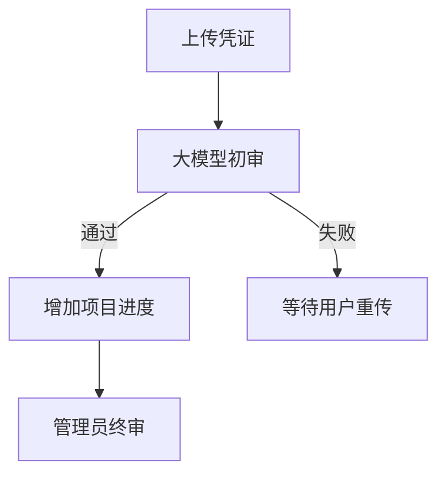

# 燃动现象智能管理平台前端文档写作与排版规范

> [!IMPORTANT]
> 本规范适用于项目内后续新增或主动修改的 Markdown 文档。文档不仅要准确，还要有清晰层级、足够留白和舒适的阅读节奏。

文档的目标不是堆积信息，而是让读者能够快速理解：**这是什么、为什么存在、如何使用，以及有哪些限制。**

---

## 1. 核心原则

### 准确优先

文档必须与当前代码、接口和业务规则一致。无法确认的信息应明确标记为“待确认”，不得根据经验补造接口、字段或业务行为。

### 保持呼吸感

通过标题、短段落、列表、分隔线和引用块组织内容。避免连续堆叠长段落、密集表格或没有视觉停顿的大段说明。

### 结论先行

每个章节先说明核心结论，再补充原因、细节和示例。读者不应阅读完整段落后才知道该段想表达什么。

### 结构稳定

同类型文档应使用相近的章节结构和术语。更新功能时优先更新原文档，避免创建内容重复、名称相近的多个版本。

> **一句话原则：** 内容准确，结构清晰，重点突出，页面留白。

---

## 2. 适用范围

本规范适用于：

- 项目级说明文档。
- 业务功能文档。
- Vue 组件文档。
- API 与服务模块文档。
- 数据库设计文档。
- 开发约定、部署说明和排障记录。

现有历史文档不要求仅为统一样式而批量重排。实际修改某份文档时，可以在不改变原意的前提下逐步调整为本规范。

> [!WARNING]
> `description/db/` 默认只读。没有用户的明确修改要求时，不得为了套用本规范而批量格式化数据库文档。

---

## 3. 标题与章节层级

### 标题规则

- 每个文件只能有一个一级标题 `#`，用于表示文档名称。
- 二级标题 `##` 用于划分主要章节。
- 三级标题 `###` 用于描述主要章节下的具体主题。
- 四级标题 `####` 仅在内容确实复杂时使用。
- 原则上不使用五级及更深标题；层级过深时应重新拆分章节或文档。

标题应直接表达内容，避免使用“其他”“相关内容”“详情”等含义模糊的名称。

```md
# 赛季表单组件

## 组件用途

### 创建模式

### 编辑模式
```

### 编号规则

较长的项目说明、业务方案可以使用 `1.`、`1.1` 形式编号。组件、接口和单一实体文档通常不需要编号。

同一文档内必须保持一致，不能一部分章节编号、一部分章节不编号。

### 分隔线规则

使用 `---` 分隔主要语义区块，尤其适合以下位置：

- 文档摘要与正文之间。
- 两个篇幅较长的二级章节之间。
- 正文与注意事项、待确认事项之间。

分隔线前后都应保留一个空行。不要在每个短小三级章节之间机械添加分隔线。

---

## 4. 留白与段落

### 必须留空行的位置

以下内容前后必须保留空行：

- 标题。
- 列表。
- 引用块与 Callout。
- 代码块。
- 表格。
- 分隔线。

不要依赖 HTML 的 `<br>` 制造大面积空白。应通过合理拆分段落和章节获得自然的阅读节奏。

### 段落长度

- 一个段落只表达一个主要观点。
- 普通段落建议控制在一至三句话。
- 内容较长时，拆分为“结论段 + 列表或示例”。
- 避免单段连续出现多个业务规则、多个异常分支和多个实现细节。

### 列表排版

简单并列信息可以使用紧凑列表。列表项包含解释、示例或多句话时，应在列表项之间留一个空行，形成更舒展的松散列表。

列表嵌套建议不超过两层。超过两层时，优先拆分为新的三级标题。

---

## 5. Markdown 表达能力

Markdown 特性应帮助读者理解内容，而不是只承担装饰作用。

| 表达方式 | 适用场景 | 使用要求 |
| --- | --- | --- |
| `**粗体**` | 核心结论、关键限制、重要动作 | 一个段落通常突出一至两个重点 |
| `` `行内代码` `` | 字段、状态、路径、命令、组件名 | 技术标识必须与普通文本区分 |
| `>` | 背景摘要、补充解释、引用内容 | 不用于承载整篇正文 |
| Callout | 提醒、重要约束、风险和待确认事项 | 根据语义选择正确类型 |
| `---` | 主要章节之间的视觉停顿 | 前后保留空行 |
| 表格 | 字段、状态、参数和映射关系 | 单元格内容保持简短 |
| 代码块 | 命令、代码、JSON 和流程示意 | 必须声明语言类型 |
| Mermaid | 多步骤流程、状态变化和模块关系 | 仅在图形明显优于文字时使用 |

### 高亮

优先使用粗体突出关键结论，例如：

> 用户选择的挑战等级是**赛季级别**的选择，不是每个项目分别选择。

字段名、枚举值和文件路径使用行内代码，例如：`review_status`、`approved`、`description/project.md`。

不要将整段文字全部加粗，也不要在同一句话中反复使用粗体、斜体和行内代码。高亮过多会失去重点。

### 普通引用块

普通引用块适合放置一句总结、背景信息或对正文的补充解释。

```md
> 项目进度由有效凭证的实际贡献总和决定，前端不自行重新计算。
```

### Callout

重要提醒使用以下 Callout：

```md
> [!NOTE]
> 对理解正文有帮助的补充信息。

> [!TIP]
> 推荐做法或可以提升开发效率的建议。

> [!IMPORTANT]
> 必须遵守的核心业务规则或开发约定。

> [!WARNING]
> 可能产生错误数据、破坏兼容性或造成误操作的风险。

> [!CAUTION]
> 涉及删除、覆盖、不可逆操作等高风险行为。
```

同一小节不要连续堆叠多个 Callout。普通说明放在正文中，只有真正需要读者停下来关注的信息才使用 Callout。

---

## 6. 表格与代码块

### 表格

表格适合表达结构固定、需要横向比较的信息，例如：

- API 参数和响应字段。
- 组件 `props`、事件与插槽。
- 状态码和业务含义。
- 数据实体之间的映射。

表格中避免放入长篇说明或多层列表。某个字段需要详细解释时，在表格后使用独立三级标题展开。

```md
| 状态 | 中文含义 | 是否可终审 |
| --- | --- | --- |
| `pending` | 待初审 | 否 |
| `preliminary_approved` | 初审通过 | 是 |
```

### 代码块

代码块必须声明语言类型，例如 `js`、`vue`、`json`、`bash`、`sql`、`text` 或 `mermaid`。

```json
{
  "projectId": 1,
  "levelId": 2
}
```

示例应只保留理解当前主题所需的内容。示例中的注释使用中文，不得包含真实密钥、令牌、个人隐私或生产环境地址。

### 流程图

当流程包含三个以上连续步骤、多个状态分支或多个模块协作时，可以使用 Mermaid。



简单的一步操作或两项对比直接使用文字，不必绘图。

---

## 7. 中文与技术术语

- 默认使用简体中文和完整、自然的句子。
- 中文与英文、数字之间保留一个空格，例如“使用 Vue 3 开发”“返回 10 条记录”。
- 中文标点使用全角符号；代码、路径和 JSON 内保持其原始格式。
- 第一次出现专业术语时写出完整名称，后续再使用简称。
- 同一个业务概念在全文中使用同一个名称，不随意切换近义词。
- 不使用“组件 or 接口”等中英文混写表达，应写为“组件或接口”。
- 避免口语化占位词，例如“这个东西”“相关处理”“等等”。

状态、字段和表名应同时保留代码值与中文含义：

```text
`preliminary_approved`：初审通过
`required_project_count`：赛季要求选择的项目数量
`proof_record`：运动凭证记录表
```

---

## 8. 内容组织顺序

不同文档可以按内容调整，但一般遵循以下顺序：

1. 文档标题。
2. 一至两段摘要，说明用途和适用范围。
3. 必要的重点提示或前置条件。
4. 核心设计、使用方式或业务流程。
5. 参数、状态、示例和边界情况。
6. 关联模块、限制与待确认事项。

> [!TIP]
> 如果一份文档无法用一句话说明用途，通常意味着主题范围过大，应考虑拆分。

---

## 9. 组件文档模板

组件文档存放在 `description/components/<业务模块>/<组件名>.md`，文件名应与组件名保持一致。

```md
# SeasonForm

`SeasonForm` 用于创建或编辑赛季信息，负责收集数据和执行前端表单校验。

> [!IMPORTANT]
> 同一时间只允许一个赛季处于进行中状态，最终约束由后端保证。

---

## 组件职责

说明组件负责什么，以及明确不负责什么。

## 使用方式

提供最小可运行示例。

## Props

| 名称 | 类型 | 必填 | 默认值 | 说明 |
| --- | --- | --- | --- | --- |

## 事件

| 事件名 | 参数 | 触发时机 |
| --- | --- | --- |

## 插槽与暴露方法

无内容时明确写“当前未提供”，不要保留空表格。

## 主要状态与异常处理

说明加载、提交、失败、空数据和重复提交等行为。

## 依赖与注意事项

记录关联接口、父级页面和重要业务限制。
```

---

## 10. API 文档模板

API 文档存放在 `description/api/<业务模块>/<接口或服务名>.md`。接口信息必须来自后端契约或实际实现，不得仅凭数据库字段推测。

```md
# 赛季管理接口

本文档描述管理端查询、创建和修改赛季时使用的接口。

> [!NOTE]
> 接口基础地址由环境变量配置，文档中只记录业务路径。

---

## 获取赛季列表

**请求：** `GET /admin/seasons`

### 查询参数

| 参数 | 类型 | 必填 | 说明 |
| --- | --- | --- | --- |

### 响应数据

| 字段 | 类型 | 说明 |
| --- | --- | --- |

### 请求示例

提供真实且脱敏的调用示例。

### 错误处理

说明可预期的业务错误、页面反馈和重试行为。

## 关联代码

列出 API 模块、调用页面和相关数据实体。
```

一个接口包含多种请求或响应结构时，应分别展示，不把多个场景挤进同一个大表格。

---

## 11. 功能文档模板

跨组件业务功能文档存放在 `description/features/<业务模块>.md`。

```md
# 运动记录审核

本文档说明管理员查看运动凭证并执行终审的完整流程。

> [!IMPORTANT]
> 管理端只发起审核操作，进度撤销与回补由后端在事务中完成。

---

## 功能目标

说明功能解决的业务问题。

## 核心流程

使用列表、文本流程或 Mermaid 展示主要步骤。

## 业务规则

记录状态限制、判断条件和关键约束。

## 页面与组件

列出涉及的页面、组件及其职责。

## 接口与数据实体

列出关联 API、服务模块和数据库实体。

## 异常与边界情况

说明空数据、接口失败、重复操作和权限不足等处理。

## 待确认事项

只记录真实存在且尚未确定的问题。
```

---

## 12. 数据库文档约定

`description/db/` 下的数据库文档是**纯数据结构说明**，不承担业务文档职责。业务背景、用户操作流程、页面展示方式和产品规则应写入 `description/project.md` 或 `description/features/`。

数据库文档继续使用“一张表一份文件”的方式，只记录以下内容：

- 表名、表注释和简短的技术用途。
- 字段名、数据类型、是否为空、默认值和字段注释。
- 主键、外键、唯一约束、检查约束和索引。
- 表之间的关联关系及级联行为。
- 枚举值、取值范围等必要的数据语义。
- MySQL 建表语句、迁移语句或结构调整说明。

推荐结构如下：

1. 表信息。
2. 字段说明表格。
3. 键与约束。
4. 索引说明。
5. 关联关系。
6. MySQL 建表或调整语句。

以下内容不应写入数据库文档：

- 项目背景、玩法说明和用户参与流程。
- 管理端或客户端的页面展示及交互行为。
- 接口请求、响应和错误处理。
- 赛季结算、审核、排行榜等完整业务流程。
- 与当前数据库结构无关的产品规划和未来需求。

> [!NOTE]
> 数据库文档可以解释字段值的数据含义，例如 `status = 1` 表示有效，但不继续展开“用户在什么页面、经过什么操作后变为有效”等业务过程。

SQL 必须使用带语言标识的代码块。字段名、表名和枚举值使用行内代码。

> [!CAUTION]
> 修改数据库文档前必须获得用户明确授权，并检查关联表、前端功能和后端接口。文档样式优化本身不构成修改数据库设计的理由。

---

## 13. 推荐与避免

### 推荐写法

> [!IMPORTANT]
> 终审拒绝后，凭证不再贡献项目进度，也不再进入后续排行榜统计。

原因和后续影响放在提示块之后分段说明，并用 `increase` 等准确字段名描述实现。

### 避免写法

```text
终审拒绝之后系统会处理进度然后排行榜也会变化还有别的凭证可能会补上来这个前端需要注意一下。
```

这类写法缺少层级、字段名称和明确责任边界，应拆分为结论、影响和职责三个部分。

---

## 14. 文档完成检查

提交或交付文档前，至少确认以下事项：

- [ ] 标题能够准确表达文档主题，且只有一个一级标题。
- [ ] 开头已经说明用途和适用范围。
- [ ] 章节之间具有合理留白，长内容已使用标题、列表或分隔线拆分。
- [ ] 关键结论已适度高亮，提醒信息使用了恰当的引用块或 Callout。
- [ ] 字段、状态、路径和命令使用了行内代码。
- [ ] 表格没有承载大段难以阅读的文字。
- [ ] 代码块已经声明语言类型，示例不包含敏感信息。
- [ ] 业务规则与 `description/project.md` 一致。
- [ ] 字段和关联关系已核对相关数据库文档。
- [ ] `description/db/` 下的文档只描述数据结构、字段语义和结构约束，没有混入业务流程或页面行为。
- [ ] 组件、接口或功能行为与当前实现一致。
- [ ] 未确认内容已经标记为“待确认”，没有凭空补全。
- [ ] 修改代码时已经同步更新对应文档，修改文档时也检查了关联内容。

> **最终标准：** 读者可以快速扫读获得结论，也可以继续阅读细节完成开发或排查问题。
