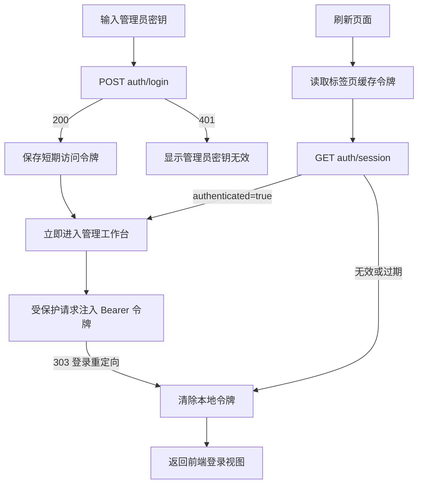

# 管理端接口准入

本文档说明管理员通过单一密钥换取短期访问令牌、恢复标签页会话，以及令牌失效后返回登录页的完整流程。

> [!IMPORTANT]
> 原始管理员密钥只用于一次登录请求。前端只缓存后端签发的短期令牌，后续受保护请求统一携带 `Authorization: Bearer <access-token>`。

---

## 功能目标

管理端在展示工作台和访问受保护接口前，必须获得后端确认的有效会话。认证逻辑集中在服务与统一请求层，业务组件不直接读取令牌或拼装认证请求头。

## 核心流程

## 令牌存储

令牌保存在 `sessionStorage` 的 `flame-admin-session` 项中，范围仅限当前浏览器标签页。存储内容包括：

- `accessToken`：后端签发的不透明访问令牌。
- `tokenType`：固定规范化为 `bearer`。
- `expiresAt`：根据签发时刻和 `expires_in` 计算的毫秒时间戳。

前端根据 `expiresAt` 安排本地过期清理，并在每次受保护请求前再次检查。关闭标签页会自动清除会话；刷新同一标签页时保留令牌并重新向后端确认。

> [!WARNING]
> `sessionStorage` 能降低跨标签页和长期残留风险，但不能防御页面脚本注入。所有页面代码仍必须避免跨站脚本攻击，不得将令牌写入日志、URL、错误提示或埋点。

## 统一请求规则

受保护接口必须通过 `src/api/adminHttpClient.js` 的 `adminFetch` 调用。该函数负责：

- 使用当前模式的 API 基础路径解析相对接口地址。
- 从标签页会话中获取仍有效的令牌。
- 覆盖调用方传入的 `Authorization`，统一设置标准 Bearer 请求头。
- 使用 `redirect: 'manual'` 禁止 Fetch 自动跟随认证重定向。
- 将可见的 `303` 或浏览器隐藏后的 `opaqueredirect` 识别为认证失效。
- 清除令牌、广播失效事件，并抛出 `AdminAuthenticationRequiredError`。

业务调用方收到认证失效后不得自动重放原请求。应用根组件统一重新展示管理员密钥输入流程，旧密钥不会缓存或再次提交。

## 页面刷新与主动退出

页面刷新时，`src/App.vue` 先检查是否存在未本地过期的令牌。存在时调用 `GET auth/session`：

- 返回 `{ "authenticated": true }` 后展示工作台。
- 返回非成功结果或认证重定向时清除令牌并展示登录页。
- 网络异常时不展示工作台，并提示管理员重新登录。

管理员点击工作台右上角退出按钮时，仅清除本地会话并返回登录页。当前后端契约没有注销接口，因此不会向服务端发送撤销请求；令牌仍会在后端缓存中自然过期。

登录或会话恢复成功后，应用立即挂载工作台。数据看板的图表模块只在后台预热，不能阻塞管理员直接进入平台配置或用户事务。

## 异常与边界情况

- 密钥为空：登录卡片在前端阻止提交。
- 密钥错误：展示后端统一返回的“管理员密钥无效”，不回显输入内容。
- 登录响应结构异常：不保存令牌，提示登录服务返回无法识别的凭证。
- 浏览器拒绝 `sessionStorage`：不进入工作台，并提示检查隐私设置。
- 令牌本地到期：定时清除并返回登录页。
- 后端服务重启导致令牌缓存丢失：下一次会话校验或受保护请求收到 `303` 后返回登录页。
- 多个并行请求同时失效：清理动作具备幂等性，应用统一保持登录视图。

## 关联代码与接口

- 应用认证编排：`src/App.vue`
- 登录卡片：`src/components/auth/AccessKeyLoginCard.vue`
- 登录与会话接口：`src/api/auth/adminAuthApi.js`
- 统一受保护请求：`src/api/adminHttpClient.js`
- 令牌会话：`src/services/adminSession.js`
- 环境请求路径：`src/config/requestPaths.js`
- 自动化测试：`tests/adminAuthentication.test.js`
- 接口文档：`description/api/auth/admin-authentication.md`

当前认证采用单一管理员密钥，不包含管理员账号、角色或细粒度权限体系。
