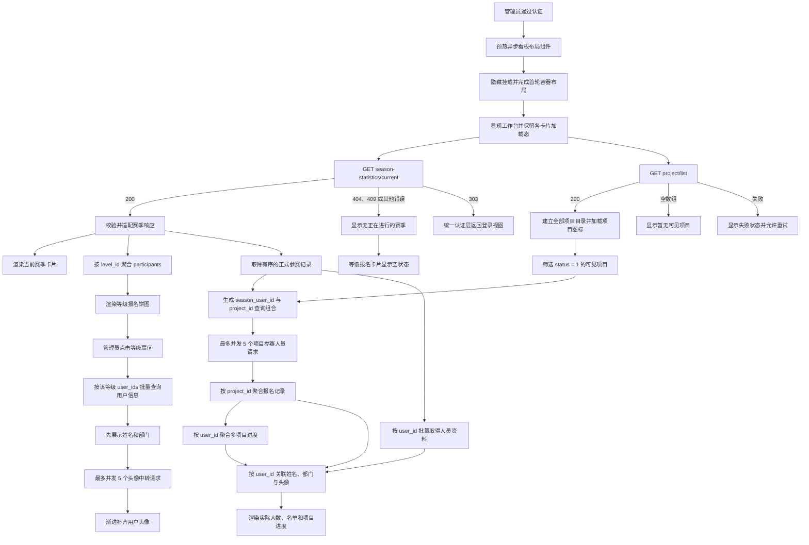

# 数据看板

数据看板为管理员展示当前激活赛季概览、正式参赛等级分布、项目报名情况和今日待办。当前赛季、等级报名统计、项目报名统计、待终审记录、待发放奖品及用户意见均已接入后端查询接口。

> [!IMPORTANT]
> 正式参赛资格完全以后端当前赛季接口返回的 `participants` 为准，前端不根据数据库字段重新筛选。

---

## 功能目标

- 管理员进入工作台后自动获取激活赛季。
- 进入前预热异步布局组件，并在浏览器完成首轮容器布局后再显现看板；业务数据继续由各区域独立加载。
- 独立获取全部项目列表并建立共享目录，再使用其中的可见项目 ID、名称、图标和稳定顺序建立项目报名卡片。
- 使用赛季名称、周期、正式参赛人数和必选项目数渲染当前赛季卡片。
- 根据起止日期计算并明确展示赛季时间进度和距离结束天数。
- 按报名等级聚合正式参赛人员，绘制各等级报名人数饼图。
- 按当前赛季参赛记录与项目逐项查询有效报名，聚合真实项目人数、人员和完成进度。
- 项目查询完成后同时按 `user_id` 建立多项目进度模型，供挑战等级人员名单复用。
- 点击等级扇区或项目柱条后，原统计卡保持正面，独立详情卡在看板中央放大浮现；原网格继续保留占位，不推动其他卡片重排。
- 点击今日待办时，在独立的大尺寸聚焦框中打开对应业务组件，不再翻转当前赛季卡片。
- 接口异常时提供稳定空状态，不继续展示旧的赛季占位数据。

## 核心流程

## 业务规则

- 看板只展示接口返回的单个 `status = 1` 赛季。
- 看板显现条件只包含异步布局组件解析、DOM 更新和浏览器首轮布局，不等待赛季、项目、待办、用户或图片接口返回。
- 正式参赛人数等于 `participants.length`。
- 等级人数按 `level_id` 聚合，`level_name` 用作展示名称。
- 每名正式参赛人员同时保留 `season_user_id` 与 `user_id`；前者供后续参赛记录查询，后者继续用于用户资料查询。
- 同一名正式参赛人员只应属于一个等级，因此各等级人数之和应与正式参赛人数一致。
- 点击等级扇区后，前端使用该等级的用户 ID 按需获取详细资料；单次最多查询 50 人，超出时保持顺序分批请求。
- 后端省略不存在的用户 ID，前端不生成空对象或占位人员。
- 用户资料返回后，再使用 `avatar_url` 通过管理端头像接口加载图片；同一时刻最多请求 5 张。
- 头像网络错误和 `5xx` 自动重试 2 次，确定性参数或文件错误不重试，最终失败时使用姓名首字。
- 项目聚合批量取得的全部用户详情会按 `user_id` 回填等级缓存；点击等级饼图时直接复用，已取得的头像也按等级缓存。
- 空 `participants` 是正常成功状态：赛季卡片显示 `0` 人，等级卡片显示“暂无等级报名数据”。
- 赛季时间进度按起止日期的自然日区间计算并限制在 `0%～100%`，不代表项目完成度或结算进度。
- 项目接口返回全部项目与 `status`，前端共享目录保留完整集合和 `project.id ASC` 顺序；数据看板明确筛选 `status = 1`，不把接口返回等同于项目可见。
- 隐藏项目不生成项目报名卡片，不参与 `season_user_id + project_id` 组合查询，也不计入新建赛季的可见项目数量。
- 待终审等历史管理场景仍使用完整项目目录映射项目名称，避免隐藏项目的既有业务记录失去可解释信息。
- 前端使用每名正式参赛人员的 `season_user_id` 与每个可见项目 ID 查询项目记录；空数组表示该用户未在当前口径下报名该项目。
- 项目响应中的 `user_id` 必须与查询所对应的当前赛季人员一致，再以此 ID 关联已取得的姓名、部门和头像资料。
- 项目报名人数等于该项目有效记录数；同一用户可以报名多个项目，因此各项目人数之和可以大于赛季正式参赛总人数。
- 项目完成进度由接口的 `0～1` 数值转换为 `0～100` 整数百分比；挑战等级沿用当前赛季人员锁定的等级。
- 同一批项目响应同时生成 `user_id → projectProgresses[]` 模型，每项包含项目 ID、名称和整数百分比，并保持可见项目目录顺序。
- 打开挑战等级人员列表后，悬停人员卡片或使用键盘聚焦，会在原卡片内切换显示该用户的全部已报名项目进度；该交互只消费聚合模型，不新增接口请求。
- 等级名单可能先于项目聚合完成；项目数据到达后只补充人员的进度数组，保留已经加载的头像和基础资料。
- 项目报名聚合完成后，各项目统计行按接口稳定顺序错峰上浮；该动画只在本轮列表首次出现时播放，不因翻面或模块往返重复触发。
- 项目参赛人员请求最多并发 5 个，网络错误和 `5xx` 自动重试 2 次，参数与响应异常不重试。
- 待终审数量来自当前赛季所有正式参赛人员的真实待终审凭证；跨人员查询最大并发 5，并按运动日期、上传时间和凭证 ID 全局倒序。
- 待终审凭证图片按原始队列每 5 张分批加载，打开每批第 4 条触发下一批；越级点击只请求目标图片，图片请求最多并发 3 个。
- 待发放奖品数量来自真实兑换流水；按后端顺序展示较早兑换记录，并以最多 5 个并发请求补齐去重后的商品信息。
- 待发放用户资料与当前赛季用户共用工作台全局目录，只批量查询尚未保存的用户 ID，头像继续复用统一受控加载链路。
- 商品图片不随列表初始化批量加载；只有悬浮或聚焦某条待发放记录时才请求当前图片，并通过浮窗展示奖品详情。
- 待发放条目提供拒绝和发放两个二次确认动作，分别提交 `rejected` 与 `distributed`；服务端返回与本次决定一致的终态后才移除，失败时保留任务和错误提示。
- 待终审、待发放奖品和用户意见独立加载时，对应今日待办卡片以三个错峰跳动圆点替代数量；请求结束后圆点先淡出，数字或错误状态再渐进浮现，切换过程保持数量区域尺寸不变。
- 三类待办处理接口成功并从本地队列移除条目后，数量按数位独立滚动；只有发生变化的个位、十位或百位向上滚出并从下方接入新数字。接口失败或二次确认尚未完成时不提前递减。
- 打开的今日待办项通过背景流光和右侧圆圈的低透明度扩散波纹共同表达选中状态；波纹不改变圆圈尺寸或列表布局。
- 当前赛季卡片只承载赛季概览。待终审、待发放奖品和用户意见分别进入看板聚焦层，并复用已加载数据与组件缓存。
- 看板聚焦层固定覆盖当前数据看板内容区；切换到平台配置或用户事务时主动收起，确保不会遮挡或改变其他页面。
- 等级和项目详情使用同一份响应式人员模型在聚焦层打开独立大尺寸卡片；原卡片不翻面，关闭详情也不会引发网格重排。
- 聚焦层蒙版始终以完整尺寸覆盖看板。为避免不同浏览器对 `backdrop-filter` 数值动画的合成差异，已模糊的独立蒙版层从完全透明平滑交叉淡入，使模糊与背景色一起逐渐出现。居中详情卡独立执行透明度、位移和缩放动画。
- 用户意见数量来自可见意见接口；列表展示姓名、头像、意见正文和创建时间，不虚构接口未返回的已读状态。
- 每条用户意见可通过悬浮气泡查看完整正文，并可提交拒绝或已优化动作；动作需要在 3 秒内二次确认，仅在处理接口成功后移除条目并同步数量，提交失败时保留条目和错误提示。
- 非空项目图标地址通过受保护图片接口获取；同一时刻最多请求 5 张，网络错误和 `5xx` 自动重试 2 次。
- 项目数量超过项目卡片可视范围时，图标、名称、柱体和人数保持对齐并整体纵向滚动，不压缩单个项目行；正反两面均不产生横向滚动。

## 页面与组件

- `MainWorkspaceShell`：请求当前赛季并编排赛季卡片、等级统计和异常状态。
- `ChallengeLevelEnrollmentCard`：管理等级饼图、等级选择、加载空态和名单翻转。
- `ChallengeLevelPieChart`：根据聚合后的等级人数绘制饼图。
- `EnrollmentFlipCard`：在等级明细面展示头像、姓名、部门，并在人员卡片悬停或聚焦时展示多项目进度。
- `ProjectEnrollmentCard`：正面展示项目人数柱状图，翻面后展示所选项目的人员完成情况。
- `ProjectEnrollmentMemberList`：以列表展示真实报名人员头像、姓名、部门、等级和项目进度条。
- `SeasonProofReviewDeck` 与 `SeasonTaskListPanel`：在独立聚焦框内承载三类今日待办，不再依附当前赛季卡片背面。

## 接口与数据实体

- 当前赛季接口：`GET /flame/admin/api/season-statistics/current`。
- 用户详情接口：`GET /flame/admin/api/user/user-info`。
- 头像中转接口：`GET /flame/admin/api/image/avator`。
- 全部项目接口：`GET /flame/admin/api/project/list`。
- 项目参赛人员接口：`GET /flame/admin/api/season-statistics/project-participants`。
- 待终审记录接口：`GET /flame/admin/api/proof/pending-final-review`。
- 终审提交接口：`POST /flame/admin/api/proof/final-review`。
- 待发放奖品接口：`GET /flame/admin/api/product/pending-distributions`。
- 奖品信息接口：`GET /flame/admin/api/product/info`。
- 奖品图片接口：`GET /flame/admin/api/image/product`。
- 奖品发放接口：`POST /flame/admin/api/product/distribute`。
- 可见用户意见接口：`GET /flame/admin/api/suggestion/list`。
- 用户意见处理接口：`POST /flame/admin/api/suggestion/process`。
- 项目等级规则接口：`GET /flame/admin/api/project/rule`。
- 凭证图片接口：`GET /flame/admin/api/image/proof_record/{proof_record_id}`。
- 项目图标接口：`GET /flame/admin/api/image/project_icon`。
- 前端接口模块：`src/api/dashboard/currentSeasonApi.js`。
- 看板布局预热服务：`src/services/dashboardLayoutPreloader.js`。
- 项目参赛人员接口模块：`src/api/dashboard/projectParticipantsApi.js`。
- 项目接口模块：`src/api/project/projectListApi.js`。
- 共享项目目录：`src/services/projectCatalog.js`。
- 项目图标接口模块：`src/api/image/projectIconApi.js`。
- 凭证图片接口模块：`src/api/image/proofRecordImageApi.js`。
- 数据适配服务：`src/services/currentSeasonDashboard.js`。
- 项目参赛人员加载服务：`src/services/projectParticipantsLoader.js`。
- 项目展示组合服务：`src/services/projectEnrollmentDashboard.js`。
- 项目图标加载服务：`src/services/projectIconLoader.js`。
- 凭证图片分批调度服务：`src/services/proofRecordImageScheduler.js`。
- 关联实体：`season`、`season_user`、`project_level`。

## 异常与边界情况

- `404`、`409` 和其他非成功状态统一显示“无正在进行的赛季”。
- 响应字段缺失或类型错误按不可用数据处理，同样进入空赛季状态。
- 认证失效由统一请求层处理，清除令牌后返回前端登录视图。
- 用户详情查询失败时保留等级明细面并提供重试；返回饼图时允许当前等级请求在后台完成。
- 用户未配置头像或头像加载失败时，使用姓名首字作为回退头像。
- 图片解码前显示加载动画，成功后从模糊状态渐进显示清晰头像。
- 切换到其他未缓存等级时取消旧的未完成请求；切换赛季或退出工作台时释放全部 Blob URL。
- 项目接口返回空数组时显示“暂无可见项目”；请求或响应异常时显示独立失败状态并允许重试，不影响其他看板区域。
- 没有激活赛季时不发起项目参赛组合请求，已取得的可见项目以 `0` 人和空名单展示。
- 项目参赛人员任一组合最终查询失败或响应用户不一致时，本轮项目统计进入失败状态并允许整体重试，避免展示不完整统计。
- 用户详情接口省略不存在的用户时，该用户不进入翻面名单，但有效项目记录仍计入项目人数。
- 单个图标为空或最终失败时保留项目名称首字，不阻断其他项目；重新加载、退出或卸载时释放图标 Blob URL。

## 当前限制

待终审列表、终审提交、待发放奖品查询与发放、可见用户意见及意见处理已经接入后端。项目、凭证与商品信息当前都按单个业务主键查询，前端使用受控并发完成小规模聚合；规模显著增长后应由后端提供有界批量接口。意见列表仍没有独立详情、已读或处理阶段字段。
