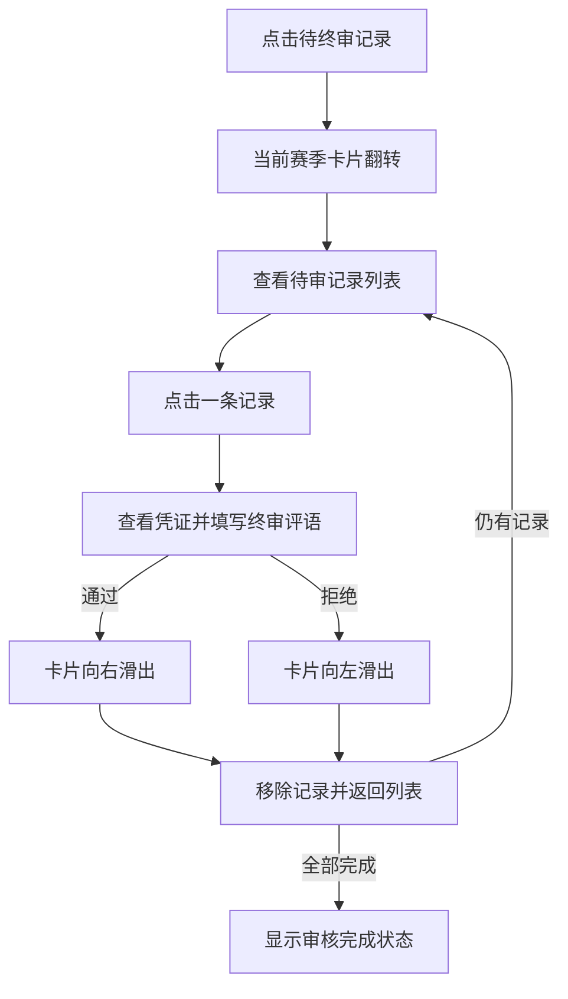

# 运动凭证终审

运动凭证终审用于让管理员持续处理已经通过模型初审的运动记录，并决定该记录能否继续贡献项目进度和排行榜资格。

当前阶段只在数据看板中提供**列表选择与单条卡片审核原型**，尚未接入后端列表与提交接口。

---

## 原型入口与流程

管理员点击“今日待办”中的“待终审记录”后，当前赛季卡片翻转到终审面板。面板先展示全部待审记录，管理员点击其中一项后再进入对应的审核卡片。

列表使用较大的条目尺寸展示用户、项目、凭证日期、挑战等级、目标要求和用户备注摘要，并支持独立滚动。管理员可以按任意顺序选择记录；从单条卡片返回时不会提交审核，也不会移除记录。列表和单条卡片之间通过淡入、位移、缩放与轻度模糊组合动画平滑切换。

每完成一条原型记录，工作台会从本地队列中移除该记录，数据看板中的待终审数量同步减一，然后回到待审列表。切换到奖品或意见页面后再次进入终审，也会继续处理剩余记录。

---

## 卡片展示内容

当前终审卡片包含：

- 用户姓名、运动项目和实际运动日期组成的轻量身份标签；悬浮或聚焦后展示赛季挑战等级与该项目的目标要求。
- 可独立纵向滚动的长图凭证区域。
- 用户提交的运动备注。
- 模型初审时写入的当前审核评语。
- 管理员必须填写的终审评语输入框。

凭证图片铺满卡片底层。用户备注与模型初审评语收纳为上下排列的两个图标，悬浮或键盘聚焦后才展开对应的完整磨砂气泡；管理员终审输入与决策按钮是唯一独占整行的底部区域。长图滚动到底时与卡片底边对齐，由卡片圆角裁切且不产生额外的底部占位。

> [!NOTE]
> 原型中的走路记录使用 `src/assets/test/` 下三张假记录按日期顺序拼接成的长图，其余项目仍使用透明运动图标。接入接口后应展示凭证的真实 `image_url`；纵向拼接图按原始宽高比铺满视窗宽度，并在固定高度区域内滚动，不带动人员信息和审核按钮离开视野。

---

## 终审状态规则

| 操作 | 目标状态 | 业务结果 |
| --- | --- | --- |
| 通过 | `approved` | 保留当前进度贡献和排行榜资格 |
| 拒绝 | `rejected` | 移除排行榜资格，撤销该凭证当前实际贡献 |

进入终审队列前，记录应满足：

- `review_status = preliminary_approved`。
- `status = 1`，记录仍然有效。
- 记录未被重传替换或作废。

管理员执行通过或拒绝前必须填写终审评语。提交后，管理员评语覆盖 `proof_record.review_comment` 中原有的模型初审评语；当前数据模型不同时保留覆盖前后的两份评语。

终审拒绝后，后端需要将该凭证的 `increase` 归零、回退对应项目进度，并尝试使用同项目下其他有效通过凭证的剩余 `progress_delta` 回补空间。

> [!IMPORTANT]
> 进度回退、回补和状态更新必须由后端保证原子性。前端只提交管理员决定，并以接口返回的最新状态刷新页面。

---

## 异常与边界状态

接入真实接口时至少需要处理：

- 首次进入时的加载、空队列和请求失败。
- 凭证图片加载失败、链接过期或管理员无访问权限。
- 超长图片解码缓慢、图片尺寸异常或内存占用过高。
- 同一记录已经被其他管理员处理的并发冲突。
- 终审提交中禁止重复操作。
- 提交失败后保留当前卡片，并允许重新提交。
- 列表分页或游标加载时，当前批次结束后继续补充下一批记录。
- 评语覆盖接口的请求格式，以及服务端如何处理并发覆盖。

其中审核意见、分页方式和并发冲突响应格式均依赖后端契约，目前标记为**待确认**。

---

## 当前原型限制

- 待审记录来自 `MainWorkspaceShell` 内的本地演示数组。
- 走路记录复用本地 `proof-record-long.png` 测试滚动，不能作为真实业务凭证。
- 审核结果只更新前端待审队列并递减本地数量，刷新页面后恢复。
- 没有真实修改 `proof_record.review_status`。
- 没有执行项目进度回退、回补或排行榜更新。
- 暂不支持拖拽手势，当前从列表进入单条记录，并通过两个审核按钮触发左右离场动画。

## 关联组件与数据

- 工作台入口：`src/components/layout/MainWorkspaceShell.vue`
- 终审工作区：`src/components/dashboard/SeasonProofReviewDeck.vue`
- 组件文档：`description/components/dashboard/SeasonProofReviewDeck.md`
- 凭证记录：`description/db/proof_record.md`
- 项目进度：`description/db/season_user_project.md`
- 项目业务：`description/project.md`
