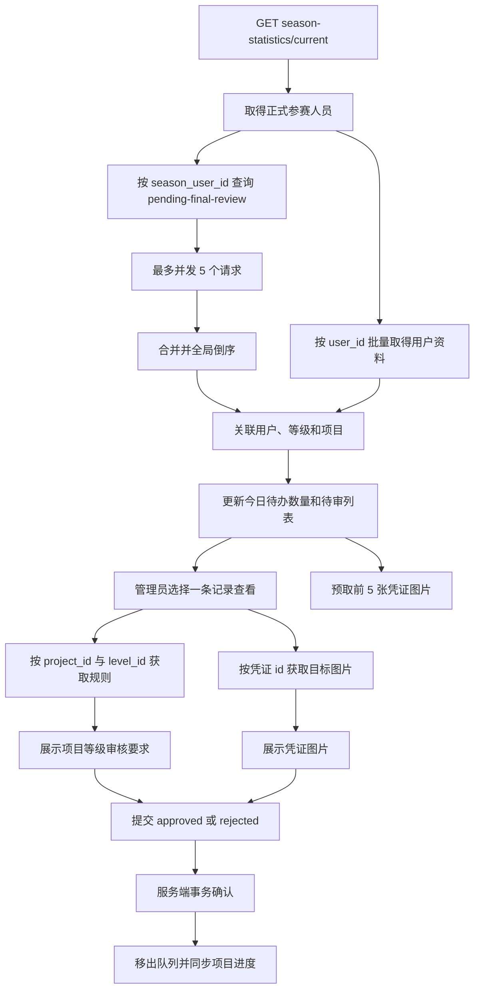

# 运动凭证终审

运动凭证终审用于展示已经通过模型初审、尚未产生终审结果的有效运动凭证，并让管理员逐条核对和提交最终决定。待终审查询、凭证图片、项目等级规则与终审提交均已接入后端。

---

## 入口与数据流程

管理员通过认证进入数据看板后，页面使用当前赛季返回的全部 `season_user_id` 查询待终审记录。查询与项目报名名单共享同一批用户基础资料。

待办数量等于当前聚合队列长度。加载期间显示同步状态；数据全部就绪后一次性挂载全部记录容器并立即加载已有头像地址，不再使用列表整体或逐条入场动画。列表在打开单条凭证时常驻 DOM，返回后不会重新创建记录容器。请求失败时显示独立错误和重试入口，空数组显示当前没有待终审记录。

## 聚合与关联规则

- 只有后端返回的记录进入队列，前端不重新推导 `review_status` 或 `status`。
- 每名正式参赛人员单独查询，最大并发为 5；网络错误和 `5xx` 最多重试 2 次。
- 任一人员查询最终失败时整轮进入失败状态，不展示不完整数量。
- 合并后按 `proof_date`、`created_at`、`id` 依次倒序，最近需要处理的凭证优先。
- 查询所对应的当前赛季人员提供 `user_id` 和挑战等级；姓名与头像地址通过共享用户资料映射取得。
- 用户头像与项目报名、等级名单共享同一次受保护头像中转请求及 Blob URL，不按业务卡片重复下载。
- 项目名称通过 `project_id` 关联可见项目列表；无法关联时保留“项目 #ID”回退文本，不丢弃凭证。
- 打开记录时使用 `project_id + level_id` 按需获取项目等级规则，并以组合键缓存；相同组合的其他凭证直接复用。
- 凭证图片只使用记录 `id` 请求 `/image/proof_record/{proof_record_id}`，不直接访问列表响应中的 `image_url`。
- 模型初审意见只读取 `preliminary_review_comment`；`review_comment` 是管理员终审意见，两者在接口适配和展示模型中保持独立。
- 初始只预取前 5 张；打开每批第 4 条后预取下一批 5 张。直接点击第 6 条以后尚未预取的记录时，只高优先级加载该记录本身。
- 图片调度最多并发 3 个请求，同一记录在排队、请求中或已加载时均去重；网络错误和 `5xx` 最多重试 2 次。
- 终审评语选填；前端在空白时按通过或未通过补入默认评语，避免提交空白字符串。
- 通过和拒绝都需要在 3 秒确认窗口内连续选择两次；超时自动恢复，切换决定会重新开始确认窗口。
- 终审属于有副作用请求，不执行自动重试；只有服务端成功后才移出记录。
- 拒绝响应包含最终项目进度时，前端同步更新项目报名名单中的对应进度，回退与回补计算完全以后端事务结果为准。

## 终审卡片

管理员点击“今日待办”中的“待终审记录”后，看板中央打开独立的大尺寸终审框，当前赛季卡片继续保持概览状态。列表展示头像、姓名、项目、挑战等级、上传日期和记录所属日期，不展示用户备注；点击记录后再查看凭证图片、完整用户备注及模型初审意见。

凭证图片在固定高度区域中独立横纵滚动，不带动身份信息和操作区。图片解码后使用原始长宽比计算初始适配宽度：横图可使用完整容器宽度，竖向长图逐步收窄并水平居中，超长拼接图最低约使用 `42%` 容器宽度，不再默认撑满固定容器。待审列表复用项目报名列表的普通 `div + article` 滚动结构，不对列表、行或长图舞台使用强制合成；聚焦框本身仍位于工作台横向变换轨道之外。列表和长图把滚轮输入同步拆分为单帧不超过 `120px` 的位移，避免大幅触控板手势一次跳入 Safari 尚未栅格化的远端区域；该限制只约束瞬时速度，不改变可访问的完整内容范围。长图在完成像素解码后才显示，解码期间保留专用加载层；图片本体不使用滤镜、透明度或缩放入场动画，滚动容器不使用绘制隔离且不逐帧读取布局尺寸，覆盖在长图上的控件也不执行实时背景模糊。右上角工具栏允许在 `100%～300%` 范围内按初始适配尺寸分级放大，不允许继续缩小，并可点击百分比恢复到 `100%`；图片尺寸只能由这些按钮调整，不额外展示“滚动看全图”提示。触控屏和触控板的双指捏合不会触发图片或页面缩放，普通滚动仍用于浏览图片。图片加载中显示动画，失败时只重试当前图片。顶部项目信息浮层按顺序展示该项目、该等级的规则指标；用户备注与模型初审意见使用紧凑入口展开。管理员评语工具栏默认收起并展示两个等高审核按钮，右侧常驻“评语”窄胶囊用于将玻璃输入区向右展开，伸缩时不改变工具栏高度。

## 状态口径

接口仅返回：

- `review_status = preliminary_approved`。
- `status = 1`。

`approved`、`rejected`、`pending`、`preliminary_rejected` 及无效记录均不会进入队列。空数组统一表示指定参赛记录下没有可终审凭证。

## 异常与边界

- `404`、`409`、`422`、`500` 或网络异常均保留当前记录，不把失败误认为审核成功。
- 认证失效由统一请求层返回登录视图，不重放终审请求。
- 后端负责锁定凭证、撤销实际贡献、按优先级回补其他凭证及写回项目进度，前端不重复计算。
- 当前接口逐个 `season_user_id` 查询；赛季人员规模明显增长后，应由后端提供有界批量或分页接口。

## 关联组件与接口

- 工作台入口：`src/components/layout/MainWorkspaceShell.vue`
- 终审工作区：`src/components/dashboard/SeasonProofReviewDeck.vue`
- 列表接口：`description/api/proof/pending-final-review.md`
- 终审接口：`description/api/proof/final-review.md`
- 凭证图片接口：`description/api/image/proof-record.md`
- 凭证记录：`description/db/proof_record.md`
- 项目进度：`description/db/season_user_project.md`
